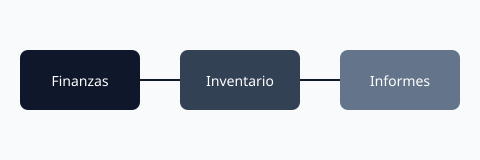

# Introducción a Business Central

Business Central es una solución de gestión empresarial en la nube diseñada para empresas pequeñas y medianas.

## ¿Qué es Business Central?

Business Central proporciona:
- Gestión financiera completa
- Gestión de inventario
- Automatización de procesos
- Reportes y análisis

## Primeros Pasos

Para comenzar con Business Central:
1. Acceder a portal de administración
2. Crear entorno de demostración
3. Configurar módulos básicos

## Conclusión

Business Central es una herramienta poderosa para gestionar tu negocio de forma efectiva.
