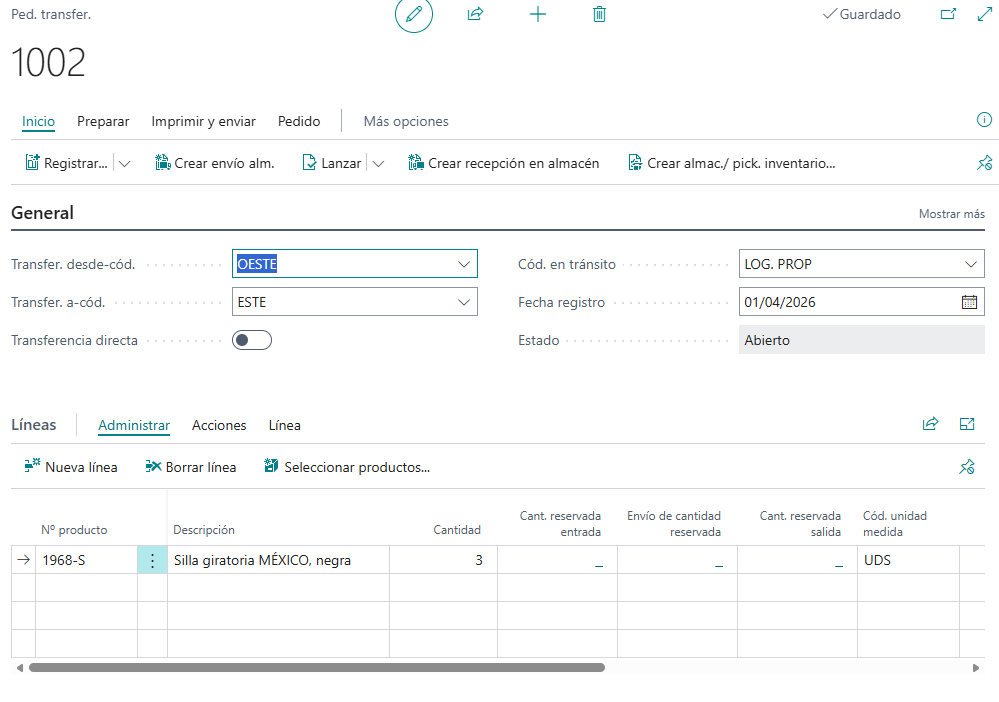

Si trabajas con varios almacenes, delegaciones o centros logísticos, sabes que mover stock de un sitio a otro es una tarea de todos los días. Y también una fuente habitual de errores: un producto que "desaparece" durante el traslado, existencias que no cuadran o pedidos que no se pueden servir porque nadie sabía dónde estaba el material.

Business Central incluye herramientas específicas para transferir productos entre ubicaciones y mantener el control de todo el proceso. En este artículo repasamos qué opciones tienes, cuándo conviene usar cada una y cómo dejar todo bien configurado antes de empezar.

## Qué es la transferencia de inventario

La transferencia de inventario te permite mover productos de una ubicación a otra dentro de tu empresa. En Business Central tienes dos métodos principales:

- **Órdenes de transferencia**.
- **Diarios de reclasificación de producto**.

Los dos actualizan el stock, pero se diferencian en el nivel de control y de complejidad. La orden de transferencia está pensada para traslados que quieres seguir paso a paso; el diario de reclasificación, para movimientos más sencillos.

En la captura puedes ver una orden de transferencia típica. En la cabecera se indican la ubicación de origen (**OESTE**), la de destino (**ESTE**), la ubicación en tránsito y la fecha de registro. Más abajo, en las líneas, añades los productos y las cantidades que quieres mover. La orden también muestra su estado (aquí, *Abierto*) y un interruptor de *Transferencia directa*.

## Principales características

Estas son las capacidades que más se aprovechan en el día a día:

- Gestión de transferencias entre múltiples ubicaciones.
- Control de las cantidades en tránsito.
- Planificación con fechas de envío y de recepción.
- Configuración de rutas de transferencia.
- Gestión de ubicaciones con distintos niveles de complejidad.
- Posibilidad de hacer transferencias directas o controladas.

## Qué aporta a tu empresa

Tener las transferencias bajo control se nota en la operativa diaria:

- **Más visibilidad** del inventario en tiempo real.
- **Menos errores** en la gestión del stock.
- **Mejor planificación** logística.
- **Control total** del inventario en tránsito.
- **Procesos optimizados** entre almacenes.

## Qué aporta a partners y consultores

Si implantas Business Central para tus clientes, esta funcionalidad te da mucho margen:

- Escenarios de implementación muy amplios.
- Adaptación a modelos logísticos complejos.
- Integración con los procesos de planificación.
- Configuración flexible según cada cliente.

## Casos de uso habituales

Algunas situaciones en las que las transferencias son la herramienta adecuada:

- Mover producto entre el almacén central y las delegaciones.
- Reponer stock en puntos de venta.
- Trasladar mercancía entre centros logísticos.
- Hacer ajustes logísticos internos.
- Regularizar inventario que está sin ubicación.

## Requisitos y configuración previa

Antes de transferir nada, deja preparados estos elementos:

1. **Define las ubicaciones** entre las que vas a mover producto.
2. **Configura las rutas de transferencia**, es decir, qué ubicación puede enviar a cuál.
3. **Establece los códigos de transporte** (es opcional).
4. **Define la ubicación en tránsito**, que es donde "vive" el inventario mientras el producto está en camino.

## Buenas prácticas

Con estos hábitos evitarás la mayoría de los problemas:

- Usa **órdenes de transferencia** cuando necesites trazabilidad.
- Usa **diarios de reclasificación** para movimientos simples.
- Configura bien las rutas logísticas desde el principio.
- Mantén la **coherencia en los códigos de ubicación**.
- Revisa con regularidad el **inventario en tránsito**.

## Checklist de implantación

Antes de dar por cerrada la configuración, comprueba que:

- ✅ Las ubicaciones están creadas.
- ✅ Las rutas de transferencia están configuradas.
- ✅ La ubicación de tránsito está definida.
- ✅ Los usuarios están formados.
- ✅ Los procedimientos están documentados.

## Resumen de funcionalidades

| Funcionalidad | Beneficio | Impacto |
|---|---|---|
| Órdenes de transferencia | Control completo del proceso | Alto |
| Inventario en tránsito | Visibilidad logística | Alto |
| Diarios de reclasificación | Movimientos rápidos | Medio |
| Rutas configurables | Planificación eficiente | Alto |

## Conclusiones

La gestión de transferencias es una funcionalidad clave para empresas con operaciones distribuidas. Te ayuda a mantener la precisión del inventario, a mejorar la eficiencia logística y a garantizar la trazabilidad de cada movimiento.

Si la configuras bien desde el principio, ganas una ventaja competitiva en entornos cada vez más exigentes. Empieza por las ubicaciones y las rutas, y elige el método que mejor encaje con el nivel de control que necesitas.
